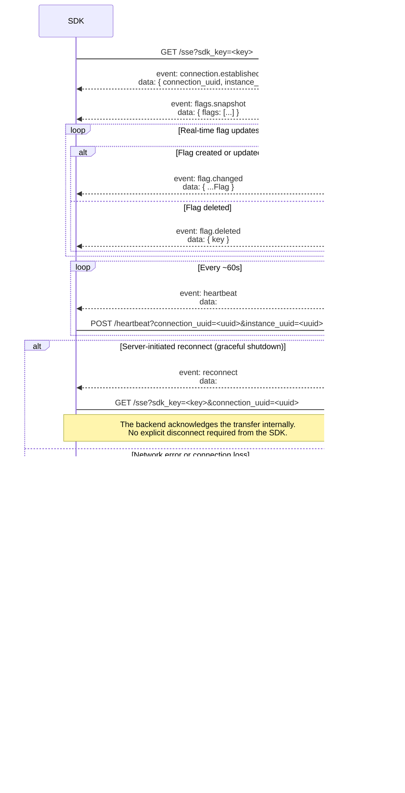

# featctrl SDK Specifications

**Version:** 0.1.0  
**Status:** Draft  
**Last updated:** 2026-04-23  

---

## Introduction

This document defines the specifications that any featctrl SDK implementation must conform to. It is intended for SDK authors and describes the protocol, data models, endpoints, and behavioural constraints required to interact correctly with the featctrl platform.

The specifications cover the full lifecycle of an SDK connection: establishing a real-time feature flag stream, maintaining it through heartbeats and reconnections, and gracefully terminating it. They also define the expected behaviour in degraded conditions and the configuration surface exposed to end users.

All requirements expressed with the keyword **must** are mandatory. Requirements expressed with **should** are strongly recommended but not strictly enforced.

---

## Table of Contents

1. [Lifecycle](#1-lifecycle)
2. [Normative Reference](#2-normative-reference)
   - [2.1 Data Models](#21-data-models)
   - [2.2 Endpoints](#22-endpoints)
   - [2.3 SSE Events](#23-sse-events)
   - [2.4 Implementation Constraints](#24-implementation-constraints)

---

# 1. Lifecycle



---

# 2. Normative Reference

## 2.1 Data Models

### Flag

The `Flag` object is the core data structure distributed to SDK clients. It represents a feature flag bound to a specific environment.

| Field | Type | Nullable | Description |
|---|---|---|---|
| `key` | `string` | No | Unique identifier of the flag within the environment. Used as the lookup key by the SDK. |
| `name` | `string` | No | Human-readable display name of the flag. |
| `flag_type` | `string` | No | Type of the flag. In this version, always `"boolean"`. |
| `enabled` | `boolean` | No | Current state of the flag. `true` means the feature is active, `false` means it is inactive. |
| `config` | `object \| null` | Yes | Reserved for future flag types. **Must be ignored** by SDK implementations in this version. |

> **Note:** The internal `id` field is never included in the serialized payload.

**Example**

```json
{
  "key": "dark-mode",
  "name": "Dark Mode",
  "flag_type": "boolean",
  "enabled": true,
  "config": null
}
```

---

## 2.2 Endpoints

All endpoints are reachable at the base URL `https://sdk.featctrl.com` (default). This base URL can be overridden via the `FEATCTRL_URL` environment variable.

---

### GET /sse

Establishes a persistent SSE connection for the given SDK key.

**Query parameters**

| Parameter | Type | Required | Description |
|---|---|---|---|
| `sdk_key` | `string` | Yes | SDK key identifying the application and environment. |
| `connection_uuid` | `UUID` | No | Previous connection UUID. Must be provided only during a server-initiated reconnect (after receiving a `reconnect` event). |

**Responses**

| Status | Description |
|---|---|
| `200 OK` | SSE stream established. The response body is a persistent event stream. |
| `400 Bad Request` | Missing `sdk_key` parameter. |
| `401 Unauthorized` | Invalid or unknown SDK key. |
| `403 Forbidden` | The application associated with the SDK key is archived. |
| `503 Service Unavailable` | The SDK must not retry immediately — apply exponential backoff. |

> **Note:** On `403`, the SDK must not retry. The application is permanently unavailable. Default flag values must be used.

---

### POST /heartbeat

Acknowledges a `heartbeat` event received on the SSE stream.

**Query parameters**

| Parameter | Type | Required | Description |
|---|---|---|---|
| `connection_uuid` | `UUID` | Yes | UUID of the current SSE connection, as received in `connection.established`. |
| `instance_uuid` | `UUID` | Yes | UUID of the server instance, as received in `connection.established`. |

**Responses**

| Status | Description |
|---|---|
| `204 No Content` | Acknowledgement published successfully. |
| `400 Bad Request` | Missing or malformed UUID parameter. |
| `503 Service Unavailable` | Internal error. The SDK must retry up to 2 times with short exponential backoff. Failure to acknowledge within the server timeout window will result in the connection being closed. |

---

### DELETE /disconnect

Signals a clean disconnection, allowing the server to immediately release the connection slot.

**Query parameters**

| Parameter | Type | Required | Description |
|---|---|---|---|
| `connection_uuid` | `UUID` | Yes | UUID of the current SSE connection, as received in `connection.established`. |
| `instance_uuid` | `UUID` | Yes | UUID of the server instance, as received in `connection.established`. |

**Responses**

| Status | Description |
|---|---|
| `204 No Content` | Disconnect signal published successfully. |
| `400 Bad Request` | Missing or malformed UUID parameter. |
| `503 Service Unavailable` | Internal error. The SDK must retry up to 2 times with short exponential backoff. |

---

## 2.3 SSE Events

All events are received on the SSE stream established via `GET /sse`. Each event follows the standard SSE format with an `event` field and a `data` field.

---

### connection.established

Sent immediately after the SSE stream is opened, before any other event. Contains the identifiers the SDK must store for the entire duration of the connection.

**Payload**

| Field | Type | Description |
|---|---|---|
| `connection_uuid` | `UUID` | Unique identifier of this SSE connection. Must be included in all subsequent `POST /heartbeat` and `DELETE /disconnect` calls. |
| `instance_uuid` | `UUID` | Unique identifier of the server instance handling this connection. Must be included in all subsequent `POST /heartbeat` and `DELETE /disconnect` calls. |

**Example**
```json
{
  "connection_uuid": "b3d1c2a0-4e5f-11ee-be56-0242ac120002",
  "instance_uuid": "a1b2c3d4-4e5f-11ee-be56-0242ac120002"
}
```

---

### flags.snapshot

Sent immediately after `connection.established`. Contains the full current state of all feature flags for the connected environment. The SDK must replace its entire local flag cache with this payload.

**Payload**

| Field | Type | Description |
|---|---|---|
| `flags` | `Flag[]` | Complete list of feature flags. See [2.1 Data Models](#21-data-models). |

**Example**
```json
{
  "flags": [
    { "key": "dark-mode", "name": "Dark Mode", "flag_type": "boolean", "enabled": true, "config": null },
    { "key": "new-onboarding", "name": "New Onboarding", "flag_type": "boolean", "enabled": false, "config": null }
  ]
}
```

---

### flag.changed

Sent whenever a flag is created or updated. The SDK must upsert this flag in its local cache.

**Payload**

The payload is a single `Flag` object. See [2.1 Data Models](#21-data-models).

**Example**
```json
{
  "key": "dark-mode",
  "name": "Dark Mode",
  "flag_type": "boolean",
  "enabled": false,
  "config": null
}
```

---

### flag.deleted

Sent whenever a flag is deleted. The SDK must remove the corresponding entry from its local cache. Any subsequent evaluation of this flag must return the configured default value.

**Payload**

| Field | Type | Description |
|---|---|---|
| `key` | `string` | Key of the deleted flag. |

**Example**
```json
{
  "key": "dark-mode"
}
```

---

### heartbeat

Sent periodically by the server as a keepalive probe. The SDK must respond by calling `POST /heartbeat` with the `connection_uuid` and `instance_uuid` received in `connection.established`.

**Payload:** none.

> **Note:** The SDK must also maintain an independent watchdog monitoring the time elapsed since the last received `heartbeat`. If no `heartbeat` is received within the expected window, the SDK must initiate a reconnection procedure. See [2.4 Implementation Constraints](#24-implementation-constraints).

---

### reconnect

Sent by the server during a graceful shutdown. The SDK must initiate a reconnection by calling `GET /sse` with the current `connection_uuid`. No explicit disconnect is required prior to reconnecting.

**Payload:** none.

---

## 2.4 Implementation Constraints

---

### Flag Cache

The SDK must maintain an in-memory cache of all feature flags for the connected environment. The cache must be:

- **Initialised** from the `flags.snapshot` payload upon connection.
- **Updated** on each `flag.changed` event (upsert by `key`).
- **Pruned** on each `flag.deleted` event (remove by `key`).
- **Replaced entirely** when a new `flags.snapshot` is received (e.g. after a reconnection).

The cache must never be persisted to disk or any external store. It is strictly an in-memory structure.

---

### Flag Types

In this version, only `boolean` flags are supported. The `flag_type` field will always be `"boolean"`. The `config` field must be ignored by SDK implementations.

Future versions may introduce additional flag types. SDK implementations should be designed to handle unknown `flag_type` values gracefully (skip and log).

---

### Default Values

Every feature flag evaluation must accept a default value as a required parameter. The default value is returned in the following cases:

- The flag cache has not yet been populated (connection not yet established).
- The requested flag key does not exist in the cache.
- The flag was deleted (`flag.deleted` received).
- The connection is lost and has not yet been restored.
- `GET /sse` returns `403 Forbidden` (permanent failure — default values must be used indefinitely, no reconnection attempt).

---

### Connection Modes

The SDK must support two operating modes:

**Livestreaming mode** *(default)*

The SDK maintains a persistent SSE connection and keeps its flag cache up to date in real time. The connection is held open until an explicit disconnect is requested by the caller.

**Snapshot mode**

The SDK establishes a connection solely to receive the initial `flags.snapshot`, then immediately calls `DELETE /disconnect` and closes the stream. No further events are processed. This mode is suitable for short-lived processes or batch jobs.

The mode must be configurable via the `FEATCTRL_MODE` environment variable (`livestreaming` or `snapshot`).

---

### Reconnection Procedure

The reconnection procedure applies in two cases:
- A `reconnect` event is received (server-initiated).
- The heartbeat watchdog detects a stale connection (see below).

The procedure must be followed strictly in this order:

1. **Stop processing events** from the current SSE stream immediately.
2. If **not** triggered by a reconnect event: call `DELETE /disconnect` to release the server-side connection slot.
3. Call `GET /sse` to establish a new connection.
   - If triggered by a `reconnect` event: include `connection_uuid` as a query parameter.
   - If triggered by the heartbeat watchdog or a network error: omit `connection_uuid`.
4. On success: process `connection.established` and `flags.snapshot` as on initial connection.
5. On failure: apply exponential backoff and retry `GET /sse` (see [Degraded Mode](#degraded-mode)).

> **Note:** While the reconnection is in progress, flag evaluations must continue to return cached values. If the cache is unavailable, default values must be used.

---

### Heartbeat Watchdog

The SDK must maintain a client-side watchdog timer tracking the time elapsed since the last `heartbeat` event was received.

- On each received `heartbeat` event: reset the watchdog timer.
- If no `heartbeat` is received within the configured watchdog window (`FEATCTRL_HEARTBEAT_WATCHDOG_SECS`, default: `120s`): initiate the reconnection procedure.

This mechanism ensures the SDK detects silent connection losses that would otherwise go unnoticed (no network error raised, no event received).

---

### Degraded Mode

When `GET /sse` fails, the SDK must apply exponential backoff before retrying:

| Attempt | Delay |
|---|---|
| 1 | 3s |
| 2 | 6s |
| 3 | 12s |
| 4+ | 30s (cap) |

The maximum number of retry attempts is configurable via `FEATCTRL_MAX_RETRIES` (default: unlimited). Once the maximum is reached, the SDK must stop retrying and rely on default values for all flag evaluations.

The following distinction applies during degraded mode:

- **Initial connection failure** (`GET /sse` fails before any `flags.snapshot` has ever been received): the in-memory cache is empty. All flag evaluations must return the configured default values.
- **Reconnection failure** (connection lost after a successful initial connection — watchdog timeout, network error, or failed reconnect attempt): the in-memory cache remains valid and must be used for flag evaluations until the connection is restored or the maximum retry count is reached.

---

### Environment Variables

| Variable | Type | Default | Description |
|---|---|---|---|
| `FEATCTRL_URL` | `string` | `https://sdk.featctrl.com` | Base URL of the featctrl SDK API. |
| `FEATCTRL_MODE` | `string` | `livestreaming` | Operating mode. Accepted values: `livestreaming`, `snapshot`. |
| `FEATCTRL_HEARTBEAT_WATCHDOG_SECS` | `integer` | `120` | Maximum number of seconds allowed between two consecutive `heartbeat` events before triggering a reconnection. |
| `FEATCTRL_MAX_RETRIES` | `integer` | unlimited | Maximum number of `GET /sse` retry attempts in degraded mode. |
| `FEATCTRL_BACKOFF_BASE_SECS` | `integer` | `3` | Initial backoff delay in seconds. Each retry doubles this value up to `FEATCTRL_BACKOFF_MAX_SECS`. |
| `FEATCTRL_BACKOFF_MAX_SECS` | `integer` | `30` | Maximum backoff delay in seconds. |

---
