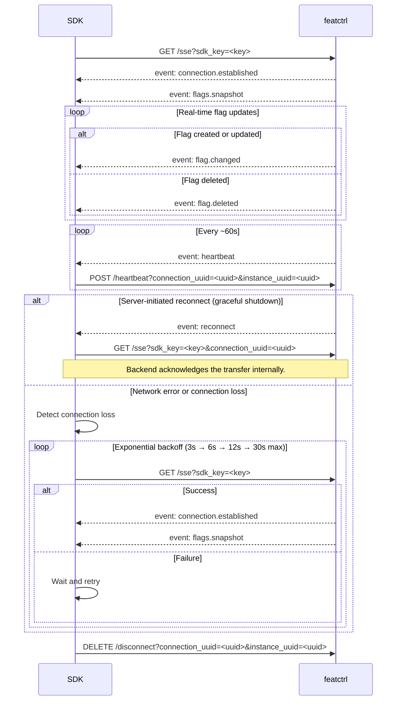

```mermaid
sequenceDiagram
    participant SDK
    participant Backend as featctrl

    %% Connection
    SDK->>Backend: GET /sse?sdk_key=<key>
    Backend-->>SDK: event: connection.established
    Backend-->>SDK: event: flags.snapshot

    %% Real-time updates
    loop Real-time flag updates
        alt Flag created or updated
            Backend-->>SDK: event: flag.changed
        else Flag deleted
            Backend-->>SDK: event: flag.deleted
        end
    end

    %% Heartbeat
    loop Every ~60s
        Backend-->>SDK: event: heartbeat
        SDK->>Backend: POST /heartbeat?connection_uuid=<uuid>&instance_uuid=<uuid>
    end

    %% Reconnection
    alt Server-initiated reconnect (graceful shutdown)
        Backend-->>SDK: event: reconnect
        SDK->>Backend: GET /sse?sdk_key=<key>&connection_uuid=<uuid>
        Note over SDK,Backend: Backend acknowledges the transfer internally.
    else Network error or connection loss
        SDK->>SDK: Detect connection loss
        loop Exponential backoff (3s → 6s → 12s → 30s max)
            SDK->>Backend: GET /sse?sdk_key=<key>
            alt Success
                Backend-->>SDK: event: connection.established
                Backend-->>SDK: event: flags.snapshot
            else Failure
                SDK->>SDK: Wait and retry
            end
        end
    end

    %% Clean disconnect
    SDK->>Backend: DELETE /disconnect?connection_uuid=<uuid>&instance_uuid=<uuid>
```
